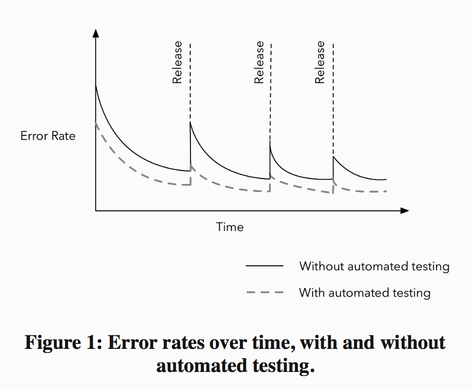

# Balance Quality with Pragmatism

- [Balance Quality with Pragmatism](#balance-quality-with-pragmatism)
  - [Establish a sustainable Code Review Process](#establish-a-sustainable-code-review-process)
  - [Manage Complexity through Abstraction](#manage-complexity-through-abstraction)
  - [Automate Testing](#automate-testing)
  - [Repay Technical Debt](#repay-technical-debt)

> Google has exceptionally high coding standards. Programming style guides dictate conventions for C++, Java, Python, JavaScript, and other languages used within the company. 

> Google even requires engineers to formally pass a readability review for each programming language that they use at the company.

> This high bar for code quality has enabled an organization of over 45,000 employees distributed across offices in over 60 countries to scale incredibly effectively.

The engineering practices that work for Google would be overkill at a startup or a small company. Requiring new engineers to read and pass a readability review would add unnecessary overhead to getting things done. Imposing strict coding standards on prototypes or experiments that might get thrown away would stifle new ideas. Writing tests and thoroughly reviewing prototype code might make sense, but blanket requirements don’t. It’s possible to over-invest in quality, to the point where there are diminishing returns for time spent.

Ultimately, software quality boils down to a matter of tradeoffs, and there’s no one universal rule for how to do things.

- High software quality enables organizations to scale and increases the rate at which engineers can produce value
- Underinvest in quality can hamper your ability to move quickly

On the other hand, it’s also possible to be overly dogmatic about code reviews, standardization, and test coverage—to the point where the processes provide diminishing returns on quality and actually reduce your effectiveness. 

We'll examine several strategies for building a high-quality codebase and consider the tradeoffs involved: the pros, the cons and the pragmatic approaches for implementing them.

## Establish a sustainable Code Review Process

The benefits of code reviews are obvisous:

- Caching bugs or design shortcomings early

- Increasing accountability for code changes: you're much les likely to add a quick and dỉty moneky patch to the code and leave the mess for another person to fix

- Posititive modeling of how to write good code: Code reviews provide an avenue for sharing best practices, and engineers can learn from their own code reviews as well as from others.

- Sharing working knowledge of the codebase.

- Increasing long-term agility: Higher-quality code is easier to understand, quicker to modify, and less susceptible to bugs. These all translate directly into faster iteration speed for the engineering team. 

> Although they usually acknowledge that code reviews can improve quality, engineers who don’t do them often cite their concern about their impact on iteration speed.

There’s a tradeoff between the additional quality that code reviews can provide and the short-term productivity win from spending that time to add value in other ways.

Given these tradeoffs, does it make sense to do code reviews? Successfully navigating this question requires a key insight: `deciding on code reviews doesn’t need to be a binary choice, where all code is either reviewed or not reviewed`. Rather, think of code reviews as being on a continuum. They can be structured in different ways to reduce their overhead while still maintaining their benefits.

- At one extreme, there's google which requires all code changes to be reviewed

- At the other end of the spectrum, smaller teams employ much nimbler code review process

- Square and Twitter often use pair programming in place of code reviews

- At Quora, we only required reviews of model and controller code for business logic; view code that rendered the web interface to users didn't need to be reviewed. Code that touched hairy infrastructure internals tended to be riskier, so we frequently reviewed those types of changes before they were committed

- Today, code review tools like GitHub and Phabricator provide lightweight web interfaces. When engineers mention a teammate’s name in a commit message, facilities like git hooks can automatically send a code review request to that person. Reviewers can make inline comments right in a web interface, easily seeing what changed since the last round of feedback. Lint checkers can automatically identify deviations from style guidelines, boosting consistency. 16 17 These tools all help reduce code review friction and focus engineering time on what matters: getting valuable feedback to the implementer.

## Manage Complexity through Abstraction

How the right abstraction increases engineering productivity:

- It reduces the complexity of the original problem into easier-to-understand primitives.

- It reduces future application maintenance and makes it easier to apply future improvements

- It solves the hard problems once and enables the solutions to be used multiple times.

Similar to time-saving tools, right abstractions can increase productivity by an order of magnitude. `Strong engineering teams invest heavily in these abstractions`. In addition to MapReduce, Google built Protocol Buffers to encode structured data in an extensible way.

`Building an abstraction for a problem comes with tradeoffs`. Building a generalized solution takes more time than building one specific to a given problem. To break even, the time saved by the abstraction for future engineers needs to outweigh the time invested.

> “Create an abstraction too early, before you have a firm handle on the general problem you’re solving, and the resulting design can be overfitted to the available use cases.”

> “Simple abstractions avoid interweaving multiple concepts, so that you can reason about them independently rather than being forced to consider them together. Techniques such as avoiding mutable state, using functional rather than imperative programming, preferring composition over inheritance, and expressing data manipulations declaratively rather than imperatively are just a few examples of how to reduce incidental complexity when building software.”

Good abstractions should be:

- Easy to learn 

- Easy to use even without documentation 

- Hard to misuse

- Sufficiently powerful to satisfy requirements

- Easy to extend

- Appropriate to the audience

`Designing good abstractions take work`. Study other people’s abstractions to learn how to build good ones yourself. Because the adoption of an abstraction scales with its ease of use and its payoffs, an abstraction’s usage and popularity provides a reasonable proxy for its quality. Here are some ideas to get you started:

+ Find popular abstractions in your codebase at work or from repositories on GitHub. Read through their documentation, dig through their source code, and try extending them.

+ Look through the open source projects at technology companies like Google, Facebook, LinkedIn, and Twitter. Learn why abstractions like Protocol Buffers, Thrift, Hive, and MapReduce have been indispensable to their growth.

+ Study the interfaces of popular APIs developed by Parse, Stripe, Dropbox, Facebook, and Amazon Web Services, and figure out what makes it so easy for developers to build on top of their platforms. Also reflect on APIs that you or the rest of community don’t like, and understand what you don’t like about them.

## Automate Testing

> Unit test coverage and some degree of integration test coverage provide a scalable way of managing a growing codebase with a large team without constantly breaking the build or the product

Automated testing doesn't just reduce bugs, it also:

- Decrease repetitive work that we’d otherwise need to do by hand.

- Leads engineers to be much more accountable for the quality of their own work.

- Tests also allow engineers to make changes, especially large refactorings, with significantly higher confidence.

> Automated tests mitigate against a culture in which people are fearful of modifying and improving a piece of code because it might break

- Tests offer executable documentation of what cases the original author considered and how to invoke the code.

> Just because automated testing is beneficial, `however, doesn’t mean that building automated tests for everything is always a good idea`. 100% code coverage is difficult to achieve. Some code is harder to test automatically than others. Moreover, unless you’re working on mission-critical or safety-critical pieces of software, dogmatically requiring test coverage for all code is unlikely to be the best use of your time. The extent to which you should automate testing again boils down to a matter of tradeoffs

Despite its benefits, it can be difficult to foster a culture of automated testing. 

> There may be organizational inertia: people may believe writing unit tests will reduce their iteration speed.

Writing the first test is often the hardest. An effective way to initiate the habit of testing, particularly when working with a large codebase with few automated tests, is to focus on high-leverage tests—ones that can save you a disproportionate amount of time relative to how long they take to write. Once you have a few good tests, testing patterns, and libraries in place, the effort required to write future tests drops. That tips the balance in favor of writing more tests, creating a virtuous feedback cycle and saving more development time. 

> Start with the most valuable tests, and go from there.

## Repay Technical Debt

> Sometimes, `we build things in a way that makes sense in the short-term but that can be costly in the long-term`. We work around design guidelines because it’s faster and easier than following them. We punt on writing test cases for a new feature because there’s too much work to finish before the deadline. We copy, paste, and tweak small chunks of existing code instead of refactoring it to support our use cases. Each of these tradeoffs, whether they’re made from laziness or out of a conscious decision to ship sooner, can increase the amount of technical debt in our codebase.

`Technical debt doesn’t just accumulate when we make quick and dirty workarounds`. Whenever we write software without fully understanding the problem space, our first version will likely end up being less cleanly designed than we’d like. Over time, we develop new insights into better ways of doing things. Since our initial understanding of problems always will be incomplete, incurring a little debt is unavoidable; it’s just part of getting things done

> The key to being a more effective engineer is to incur technical debt when it’s necessary to get things done for a deadline, but to pay off that debt periodically. `As Martin Fowler, author of the book Refactoring, points out`, “The all too common problem is that development organizations let their debt get out of control and spend most of their future development effort paying crippling interest payments.

Different organizations use various strategies to manage technical debt:

- Asana, a startup that builds an online productivity tool, schedules a Polish and Grease Week at the end of every quarter to pay off any UI and internal tools debt that they might have accumulated. 
  
- Quora devotes a day after every week-long hackathon to do cleanup work. Some companies explicitly schedule rewrite projects (with their attendant risks) when their technical debt gets too high, evidenced by slow development speed visibly taxing the team’s ability to execute. 
  
- Google holds Fixit days like Docs Fixit, Customer Happiness Fixit, or Internationalization Fixit—where engineers are encouraged to tackle specific themes—as a lightweight mechanism to pay off technical debt.

- LinkedIn, for example, paused feature development for two whole months after the company went public. They used the downtime to fix a broken process—engineers were taking a month to deploy new features—and then resumed development at a much faster rate

> "I once organized a Code Purge Day where a group of teammates and I deleted code that was no longer being used from the codebase. It was a small but focused effort with little risk of failure—plus, who doesn’t like the feeling of getting rid of unused code? We purged about 3% of our application-level code, and it was easy to justify because it saved other engineers wasted time navigating around stale and irrelevant parts of the codebase."

Unfortunately, technical debt often is hard to quantify. Not all technical debt is worth repaying. `Rather than blindly repaying technical debt wherever they find it, effective engineers spend their finite time repaying the debt with the highest leverage—code in highly-trafficked parts of the codebase that takes the least time to fix up.`
